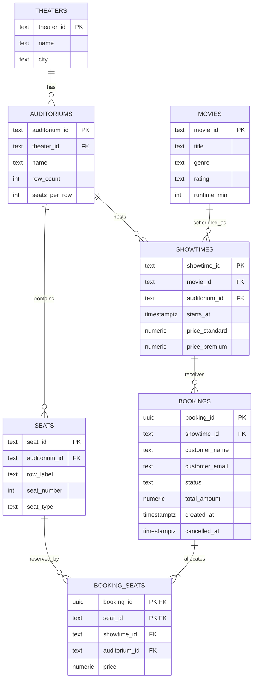

# Movies Booking App on Databricks

A thin, end-to-end prototype of a movie ticket booking service: browse movies,
pick a theater and showtime, choose assigned seats on a seat map, and book
them. It runs entirely on Databricks — a **Databricks App** (FastAPI + Vue 3)
on top of **Lakebase** (Databricks managed Postgres) registered in **Unity
Catalog**, with Delta for analytics, all deployed with **Databricks Asset
Bundles**.

Built for the Databricks Resident Architect take-home exercise.

> **Status (2026-09-06):** infrastructure is deployed by the bundle (Lakebase
> instance, Unity Catalog registration, analytics catalog and schema, SQL
> warehouse, Databricks App), the schema and seed data are loaded, and the
> backend API and seat-map UI are complete — the full booking flow, including
> the `409` on a raced seat, is verified against the live Lakebase. Remaining:
> final verification of the deployed app on-platform, and the analytics job.

---

## Where it runs

| Item | Value |
|------|-------|
| Databricks App URL | `https://movies-app-2485046985091381.aws.databricksapps.com` |
| Workspace | `https://dbc-66830d2c-97a4.cloud.databricks.com` (Slalom) |
| Lakebase instance | `movies-app-dev` (CU_1, Postgres 16), database `movies`, schema `movies` |
| Unity Catalog (transactional) | `movies_app_dev.movies` — the Lakebase database registered as a UC catalog |
| Unity Catalog (analytics, Delta) | `movies_analytics_dev.movies` — catalog and schema deployed; gold tables are the pending `analytics_job` |
| SQL warehouse | `movies_analytics` (serverless, 2X-Small) |
| Tables | `movies`, `theaters`, `auditoriums`, `seats`, `showtimes`, `bookings`, `booking_seats` |
| Bundle | `movies_app_bundle`, target `dev`, direct engine |
| Code | this repository |

---

## What you can do

1. Browse the movies playing this week.
2. Pick a theater and one of its showtimes.
3. See the auditorium seat map with live availability (standard, premium,
   accessible seats; booked seats greyed out).
4. Select one or more seats, enter a name and email, and book.
5. Get a confirmation with a booking id; the booking is committed in Lakebase
   and visible in Unity Catalog.
6. Try to book the same seats again and get a `409 Conflict` with the taken
   seat ids — the database's unique constraint, not application code, rejects it.

No login and no payment: both are explicitly out of scope for the exercise.

---

## Architecture

```
┌──────────┐  HTTPS  ┌──────────────────────────────────────────┐
│ Browser  │ ──────▶ │ Databricks App  "movies-app"              │
│ (Vue 3)  │ ◀────── │  FastAPI                                  │
└──────────┘         │   ├─ /            static SPA (frontend/dist)
                     │   └─ /api/*       routers → services      │
                     └──────────────┬───────────────────────────┘
                                    │ psycopg, OAuth token of the app's
                                    │ service principal, sslmode=require
                                    ▼
                     ┌──────────────────────────────┐
                     │ Lakebase "movies-app-dev"     │  managed Postgres, CU_1
                     │  db movies · schema movies    │  7 tables, enforced constraints
                     └──────────────┬───────────────┘
                                    │ registered as a UC catalog
                                    ▼
                     ┌──────────────────────────────┐
                     │ Unity Catalog                 │
                     │  movies_app_dev.movies.*      │  browse + query from warehouse movies_analytics
                     │  movies_analytics_dev.movies.*│  Delta gold tables (analytics_job — planned)
                     └──────────────────────────────┘

Deploy-time:  databricks bundle deploy         → Lakebase instance, UC registration, analytics catalog + schema,
                                                 SQL warehouse, app, analytics job; uploads the app source
              databricks bundle run movies_app → app deployment on the Apps runtime: npm install, pip install,
                                                 npm run build (Vue → frontend/dist), then python -m backend.serve
              python src/seed/seed_lakebase.py → Postgres schema, tables, seed data, grants for the app
```

| Concern | Choice | Alternatives considered |
|---------|--------|-------------------------|
| Hosting | Databricks Apps (one app serves API + SPA) | External container hosting; rejected because the brief requires on-platform |
| API | Python 3.11 + FastAPI | Node/Express; Python chosen for first-class Databricks SDK support |
| UI | Vue 3 + Vite + TypeScript, prebuilt to static files | Streamlit/Dash; rejected because a seat map needs a real component model |
| Transactional store | **Lakebase** (managed Postgres): enforced PK/FK/UNIQUE, row locks, ms commits | Delta via SQL warehouse: no unique constraints, no cross-table transactions, seconds per commit — fine for analytics, wrong for seat allocation |
| Governance | Lakebase database registered in Unity Catalog (`database_catalogs`) | Copying rows into Delta with a job; unnecessary for browsing and querying the schema |
| Analytics *(planned)* | Delta gold tables in a bundle-managed catalog, built by a bundle job (`sql_task` on the bundle's own serverless warehouse reading the Lakebase catalog) | Lakeflow Declarative Pipeline; a single SQL task is enough for two gold tables |
| App → DB auth | App's own service principal + short-lived OAuth token via the Databricks SDK | Native Postgres passwords; disabled on the instance |
| Infrastructure as code | Databricks Asset Bundles, direct engine, one `dev` target: database, catalogs, schema, warehouse, app and job in one bundle | Manual UI setup; bundles make every asset the panel sees reproducible from the repo |

Decision log with the full rationale for each of these: `docs/DECISIONS.md`.
(An expanded `docs/ARCHITECTURE.md` is still to be written.)

---

## Data model



- Reference data (`movies`, `theaters`, `auditoriums`, `seats`, `showtimes`) is
  loaded by the seed script and read-mostly.
- `bookings` is the order header; `booking_seats` is the seat allocation.
- The business invariant is **`UNIQUE (showtime_id, seat_id)` on
  `booking_seats`**, enforced by Postgres. Every constraint in the diagram is
  a real, enforced constraint.
- `booking_seats` carries `showtime_id` and `auditorium_id` so that composite
  foreign keys pin each seat row to its header's showtime and to the room that
  showtime plays in. A seat sold into the wrong room, or under the wrong
  booking, is unrepresentable rather than merely validated against.
- The same schema is browsable in Unity Catalog as `movies_app_dev.movies`.

Full notes: `docs/DATA_MODEL.md`.

---

## API

| Method | Path | Purpose |
|--------|------|---------|
| GET | `/api/health` | liveness + a round-trip to Lakebase |
| GET | `/api/movies` | list movies |
| GET | `/api/movies/{movie_id}` | movie detail |
| GET | `/api/theaters` | list theaters |
| GET | `/api/showtimes?movie_id=&theater_id=&date=` | showtimes with movie, theater, auditorium names |
| GET | `/api/showtimes/{showtime_id}/seats` | seat map with per-seat price and `available` / `booked` status |
| POST | `/api/bookings` | book seats → `201` booking, `409` with `taken_seat_ids`, `422` on validation |
| GET | `/api/bookings/{booking_id}` | booking with seats |
| DELETE | `/api/bookings/{booking_id}` | cancel (stretch) |

Interactive docs are served by FastAPI at `/docs` on the running app.

---

## Repository layout

```
dbx-movies-app/
├── README.md, CLAUDE.md            this file; build/decision log for AI-assisted work
├── docs/                           data model, decisions, AI usage log
└── movies_app_bundle/              Databricks Asset Bundle (direct engine)
    ├── databricks.yml              variables, target, sync rules
    ├── resources/lakebase.yml      Lakebase instance + Unity Catalog registration
    ├── resources/lakehouse.yml     analytics catalog + schema + SQL warehouse
    ├── resources/app.yml           Databricks App + lakebase / sql-warehouse resources
    ├── src/seed/                   check_connection.py, ddl.sql, seed_lakebase.py
    └── movies_app/                 app source (source_code_path)
        ├── app.yaml                command + env for Databricks Apps
        ├── package.json            build script that Databricks Apps runs at deploy → frontend/dist
        ├── requirements.txt        requirements-dev.txt, Makefile
        ├── backend/                FastAPI
        ├── frontend/               Vue 3 + Vite + TS  →  frontend/dist
        └── tests/                  pytest
```

---

## Run it

### Prerequisites

- Databricks CLI ≥ 1.15 (the bundle uses the direct engine, which the
  `catalogs` resource requires) with a profile named `movies` for the target
  workspace (`databricks configure --host https://dbc-66830d2c-97a4.cloud.databricks.com --profile movies --token`,
  or OAuth via `databricks auth login`); the `dev` target references that profile
- Python 3.11+ locally to seed the database and run the backend; Node 20+ only
  for local frontend development. The frontend is built on the Databricks Apps
  runtime at deploy time, so no local build is needed to deploy
- Permission to create a Lakebase instance, catalogs and a SQL warehouse in the
  workspace

### Deploy to Databricks

```bash
cd movies_app_bundle
databricks bundle validate -t dev
databricks bundle deploy   -t dev                           # Lakebase, UC registration, catalog, schema, warehouse, app, job; uploads the app source
databricks bundle run movies_app -t dev                     # app deployment: npm install, pip install, npm run build (frontend → dist), start
databricks apps get movies-app -p movies                    # note url + service_principal_client_id
pip install "psycopg[binary]" databricks-sdk
DATABRICKS_CONFIG_PROFILE=movies python src/seed/seed_lakebase.py --app-sp-client-id <client-id>
```

The first deploy provisions the Lakebase instance (a few minutes). Open the
URL from `databricks apps get`; the first start takes a minute while the
runtime installs `requirements.txt`.

To pause the database between sessions set `stopped: true` in
`resources/lakebase.yml` and redeploy; set it back before the demo.

### Run locally

```bash
cd movies_app_bundle/movies_app
python -m venv .venv && source .venv/bin/activate && pip install -r requirements.txt
export DATABRICKS_CONFIG_PROFILE=movies LAKEBASE_INSTANCE=movies-app-dev LAKEBASE_DATABASE=movies LAKEBASE_SCHEMA=movies
python -m backend.serve                            # http://localhost:8000
# second terminal
cd frontend && npm install && npm run dev          # http://localhost:5173, proxies /api → :8000
```

Locally the backend authenticates to Lakebase as you (OAuth token generated
through the CLI profile); on the platform it authenticates as the app's
service principal. Same code path.

---

## Assumptions and scope cuts

| Area | Assumption |
|------|-----------|
| Users | No authentication; a booking records a name and email |
| Payments | None; a booking is confirmed immediately |
| Pricing | Per showtime: `standard` and `premium` prices; `accessible` seats are priced as standard |
| Seat holds | No temporary holds or timers; the booking transaction is the reservation |
| Cancellations | Stretch feature only (`DELETE /api/bookings/{id}`) |
| Theaters | Several theaters, each with one or two auditoriums; one auditorium per showtime |
| Currency / time | USD; timestamps stored and shown in UTC |
| Environments | One `dev` target for the exercise; staging/prod would add a service principal deployer and a `mode: production` target |
| Data | Seeded, deterministic fake data (movies, theaters, showtimes over the next 7 days) |

---

## Preventing double-booking

The whole booking is one Postgres transaction: insert the header, insert one
`booking_seats` row per seat, update the total, commit. `booking_seats` has
`UNIQUE (showtime_id, seat_id)`, so if two customers race for the same seat
the second insert fails with a unique violation, the transaction rolls back,
and the API answers `409` with the seats that are already taken. Nothing is
enforced in application code, and nothing needs to be compensated.

This is exactly why the transactional tables live in Lakebase rather than
Delta: Delta has no unique constraints, no row locks, and no multi-table
transactions, and its commit latency is seconds. Delta stays the analytics
layer.

---

## Taking it to millions of users

- **Lakebase capacity**: scale the instance (CU_1 → CU_8), add readable
  secondaries for the seat-map reads, use child instances for staging
  branches. Add a `seat_holds` table with `expires_at` for checkout timers and
  idempotency keys on `POST /api/bookings`.
- **Reference data from the lakehouse**: curate movies, theaters and
  schedules in Delta and push them to Lakebase with synced tables; the app
  only writes bookings.
- **Analytics** on Delta with Lakeflow Declarative Pipelines
  (bronze → silver → gold), materialized views for occupancy and revenue, and
  AI/BI dashboards or Genie for business users, all over the Unity Catalog
  registration of the Lakebase database.
- **API tier**: stateless FastAPI behind a CDN, horizontal scaling, connection
  pooling with token refresh, rate limiting per client.
- **Operations**: Unity Catalog audit logs and system tables for observability,
  multi-region deployment with regional Lakebase instances, bundles promoted
  through dev → staging → prod by a service principal.

A one-page version with a diagram (`docs/SCALE_TO_MILLIONS.md`) is still to be
written.

---

## How AI was used

The exercise explicitly asks for AI as a force multiplier. The running log of
what was generated, what was corrected by hand, and the rough split is in
`docs/AI_USAGE_LOG.md`. In short: AI drafted the architecture options, the
bundle resources, the schema and seed data, most of the backend and frontend
code, and the docs; the human set the scope, chose Lakebase over Delta for the
transactional path, defined the naming conventions and bundle structure,
reviewed every Databricks resource before deploying, and validated the booking
flow on-platform.

---

## Not built (deliberately)

Seat holds with expiry, cancellations and refunds, authentication, payments,
multi-currency, synced reference tables, staging/prod targets. Each is sketched
with its Databricks mapping under "Taking it to millions of users" above and in
`docs/DECISIONS.md`.
