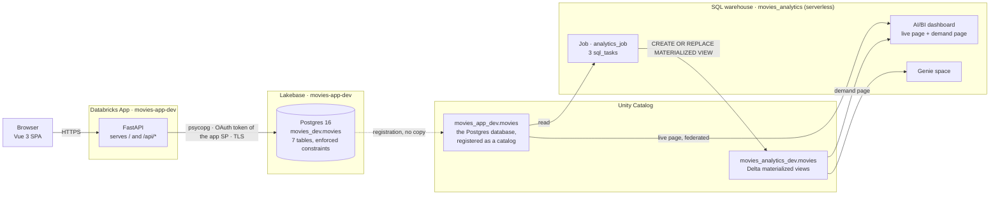
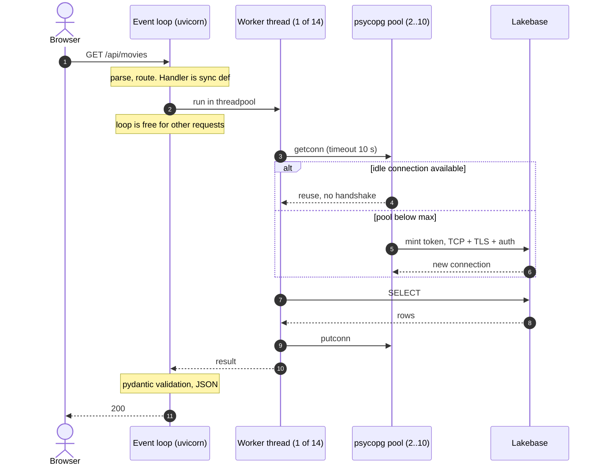
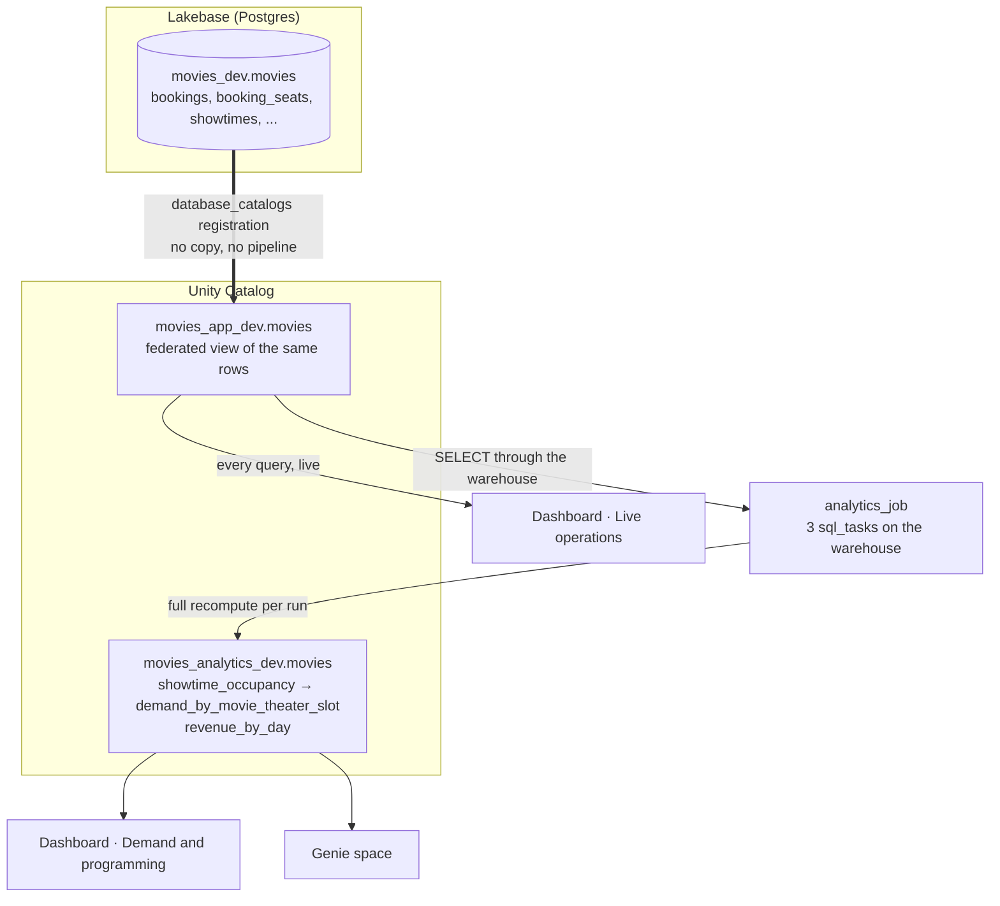

# Architecture

How the movies booking app is put together on Databricks: which platform
services it uses and why, how the app itself is structured, what happens during
one HTTP request and one booking, and how data moves from Lakebase into the
lakehouse. The trade-offs behind each choice are argued in
[DECISIONS.md](DECISIONS.md); the schema is in [DATA_MODEL.md](DATA_MODEL.md).

---

## 1. Databricks services in use



| Service | Role here | Why this and not the alternative |
|---------|-----------|----------------------------------|
| **Databricks Apps** | Hosts one process that serves the API and the static SPA. Injects the app's service-principal credentials and the Lakebase host. | The brief requires frontend and backend on the platform. One app, one deploy, no external hosting. |
| **Lakebase** (managed Postgres) | System of record: the seven transactional tables with enforced PK, FK, UNIQUE and CHECK constraints. | Assigned-seat booking is OLTP. It needs a unique constraint, row locks and millisecond commits. Delta enforces no uniqueness, has no multi-table transactions and commits in seconds. |
| **Unity Catalog** | The Postgres database is registered as catalog `movies_app_dev` with no data copy; Delta analytics live in `movies_analytics_dev`. | One governance surface over both stores. The registration is the bridge that lets a SQL warehouse read live bookings with no ETL. |
| **SQL warehouse** (serverless) | Runs the analytics job, the dashboard and Genie. | Serverless, 2X-Small, auto-stops after 20 minutes. Cold start is about 20 seconds. |
| **Job** (`analytics_job`) | Three `sql_task` steps, one per gold materialized view, on a paused daily schedule. Run on demand after a re-seed. | A single SQL task per view is enough for three objects; a full pipeline would be ceremony here. |
| **Delta materialized views** | Gold layer: `showtime_occupancy`, `demand_by_movie_theater_slot`, `revenue_by_day`, every column commented. | Governed objects with a refresh history in Unity Catalog. Every refresh is a full recompute, because federation over Postgres has no change feed. |
| **AI/BI dashboard** | Two pages: live operations over the federated Postgres tables, demand and programming over the gold views. | Both kinds of question on one surface, each answered from the store suited to it. |
| **Genie space** | Natural-language questions over the gold views only. | One curated model means exactly one way to compute a metric. The column comments are what Genie reads. |
| **Asset Bundles** (direct engine) | Every resource above is declared in `movies_app_bundle/resources/`. | Reproducible from the repo. The `catalogs` resource needs the direct engine. |

---

## 2. The app

### Backend (`movies_app/backend/`)

```
serve.py      uvicorn entrypoint, port from DATABRICKS_APP_PORT
main.py       FastAPI app, lifespan (opens the pool), exception handlers, SPA mount
config.py     Settings from env: LAKEBASE_*, PG*, pool and threadpool sizes
db.py         connection pool, query(), transaction(), token refresh
models.py     Pydantic request/response models
routers/      catalog.py (movies, theaters, showtimes) · seats.py · bookings.py
services/     booking_service.py, the booking transaction
```

**Connecting to Lakebase.** The backend authenticates as the app's service
principal. It asks the Databricks SDK for a database credential (an OAuth token
valid about an hour, cached and refreshed after 50 minutes) and connects with
psycopg over TLS to the host the platform injects as `PGHOST`. Locally the same
code runs as the developer through a CLI profile. Connections are pooled
(`psycopg_pool`, 2 to 10 connections) and the token is minted at connect time,
so a token rotation never invalidates a pooled connection mid-flight.

**Serving the SPA.** The Vue app is built on the Apps runtime at deploy time
into `frontend/dist`. FastAPI mounts that directory at `/`, and a 404 handler
serves `index.html` for any non-`/api` path so vue-router's history mode works
on a hard refresh.

### API

| Method | Path | Returns |
|--------|------|---------|
| GET | `/api/health` | step-by-step credential and connection diagnostics, pool stats, `SELECT 1` |
| GET | `/api/movies` · `/api/movies/{id}` | movie list · one movie |
| GET | `/api/theaters` | theater list |
| GET | `/api/showtimes?movie_id=&theater_id=` | future showtimes with movie, theater and auditorium names |
| GET | `/api/showtimes/{id}/seats` | seat map by row, each seat `available` or `booked` with its price |
| POST | `/api/bookings` | `201` booking · `409` with `taken_seat_ids` · `422` on validation |
| GET | `/api/bookings/{id}` | booking with its seats |

Any endpoint answers `503` with `Retry-After` when every pooled connection is
busy. FastAPI serves interactive docs at `/docs`.

### Frontend routes

`/` movies grid → `/movies/:id` theater picker and showtimes →
`/showtimes/:id` seat map and customer form → `/bookings/:id` confirmation.
On a `409` the seat map re-fetches and marks the seats that were lost.

---

## 3. One HTTP request, end to end



Three things make this work at concurrency:

- **Handlers are sync `def`, not `async def`.** psycopg blocks, so FastAPI
  runs each handler in a worker thread and the event loop keeps accepting
  requests. An async handler would hold the loop for the whole round trip and
  serialise every user behind it.
- **The threadpool is sized from the connection pool** (`PG_POOL_MAX + 4`,
  ADR-008). Forty default threads competing for ten connections would admit
  work the database cannot serve. Sized together, an admitted thread almost
  always finds a connection, and excess requests wait cheaply as coroutines.
- **A saturated pool is a `503`, not a `500`.** Waiting past the pool timeout
  raises `PoolTimeout`, which a handler turns into `503` with `Retry-After`.
  That is backpressure the client can act on.

---

## 4. One booking, end to end

```
POST /api/bookings {showtime_id, seat_ids[], customer{name, email}}

1. Validate outside the transaction: showtime exists and is in the future,
   1 to 8 seats, no duplicates, every seat belongs to the showtime's
   auditorium. Failures are 422 naming the bad ids.
2. BEGIN
     INSERT INTO bookings (...) RETURNING booking_id
     INSERT INTO booking_seats (booking_id, showtime_id, seat_id, auditorium_id, price)
       SELECT ... FROM seats JOIN showtimes USING (auditorium_id)
       WHERE showtime_id = %s AND seat_id = ANY(%s)
     UPDATE bookings SET total_amount = (SELECT sum(price) ...)
   COMMIT                                   -> 201
3. UniqueViolation -> ROLLBACK -> query which seats are taken -> 409
```

The invariant is `UNIQUE (showtime_id, seat_id)` on `booking_seats`. Postgres
serialises concurrent inserts on that key, so when two customers race for a
seat the second insert fails, the whole booking rolls back, and the API answers
`409` with the seats already taken. There is no application locking and nothing
to compensate. Two composite foreign keys on `booking_seats` also make a seat
sold into the wrong room unrepresentable (ADR-001, ADR-003).

This transaction is the reason the transactional tables live in Lakebase and
not in Delta.

---

## 5. From Lakebase to the lakehouse



Data takes two paths out of Postgres, chosen by how fresh the answer has to be.

**The hot path is federation.** Registering the Lakebase database in Unity
Catalog (`database_catalogs` in `resources/lakebase.yml`) makes the Postgres
tables queryable from a SQL warehouse as `movies_app_dev.movies.*`. Nothing is
copied. The dashboard's *Live operations* page queries these tables directly, so
a seat booked in the app is on the tile at the next refresh. The cost is that
every such query hits Postgres, which is fine for a handful of tiles and wrong
for an analyst workload.

**The cold path is the gold layer.** `analytics_job` runs three SQL files on
the warehouse, each a `CREATE OR REPLACE MATERIALIZED VIEW` that reads the
federated tables and writes Delta in `movies_analytics_dev.movies`:

| Materialized view | Grain | Source |
|-------------------|-------|--------|
| `showtime_occupancy` | one row per showtime: capacity, seats sold, revenue, settled or upcoming | federated Postgres tables |
| `demand_by_movie_theater_slot` | movie × theater × time slot over settled showtimes only | `showtime_occupancy` |
| `revenue_by_day` | one row per day | federated Postgres tables |

The second view depends on the first, so the job orders the tasks. Every
refresh is a full recompute: Lakehouse Federation over Postgres has no change
feed, so there is nothing to refresh incrementally. What the materialized views
buy over plain tables is a governed object with a refresh history in Unity
Catalog. The *Demand and programming* page and the whole Genie space read only
these views, so there is one curated model and one way to compute each metric.

Because the gold layer is a snapshot, re-seeding the database moves every
showtime and leaves the views describing the previous window until the job runs
again. The live page needs no such step.

**At scale** the same shape holds with different parts: a Lakeflow Declarative
Pipeline replaces the three SQL tasks, reference data flows the other way from
Delta into Lakebase with synced tables, and the app only ever writes bookings.

---

## 6. Deploying

```
databricks bundle deploy -t dev        every resource + upload of movies_app/
databricks bundle run movies_app       new app deployment: npm install, pip install,
                                       npm run build (Vue → frontend/dist), start
python src/seed/seed_lakebase.py       schema, seed data, grants for the app SP
databricks bundle run analytics_job    build the three materialized views
```

Two couplings are worth knowing. The Apps runtime injects the app's
service-principal credentials and port, but not the database host: `PGHOST` is
mapped explicitly in `resources/app.yml` with `value_from: lakebase` (ADR-005).
And the SPA is built on the platform, never locally (ADR-004): a root
`package.json` makes the deployment run `npm run build` before the start
command, so a type error fails the deploy rather than the running app.
